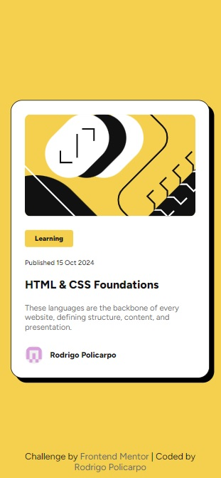

# Frontend Mentor - Blog Preview Card solution

This is a solution to the [Blog preview card challenge on Frontend Mentor](https://www.frontendmentor.io/challenges/blog-preview-card-ckPaj01IcS). Frontend Mentor challenges help you improve your coding skills by building realistic projects.  

## Table of contents

- [Overview](#overview)
  - [Screenshot](#screenshot)
  - [Links](#links)
- [My process](#my-process)
  - [Built with](#built-with)
  - [What I learned](#what-i-learned)
  - [Continued development](#continued-development)
  - [Useful resources](#useful-resources)
- [Author](#author)

## Overview

### Screenshots
- Desktop


- Tablet


- Mobile



### Links

- Solution URL: [GitHub](https://github.com/Rodrigo-Policarpo/blog-preview-card)
- Live Site URL: [GitHub Pages](https://rodrigo-policarpo.github.io/blog-preview-card/)

## My process

### Built with

- Semantic HTML5 markup
- CSS custom properties
- Flexbox
- Mobile-first workflow

### What I learned

In this project, I learned how to use `Media Queries` to manipulate the font-size of elements on screen. Frontend Mentor set the challenge of creating a responsive font-size without using Media Queries, but unfortunatelly I didn't find anything useful on my research, which made me use media queries in the end.

The addition I liked most was in CSS, when using `transition` and `hover` properties to make colorful animations in some texts:
```css
.card .article-description .article-title {
    ...
    transition: 0.3s ease-in-out;
}

.card .article-description .article-title:hover {
    color: var(--Yellow);
}
```

### Continued development

The main concepts I need to improve and domain still the responsiveness, especially without the use of Media Queries, which can be very useful in certain situations.

### Useful resources

- [W3Schools](https://www.w3schools.com/cssref/playdemo.php?filename=playcss_box-shadow) - This helped me with the correct use of CSS Box Shadow.
- [freeCodeCamp](https://www.freecodecamp.org/news/use-svg-images-in-css-html/) - This helped me with some doubts about using SVG images in CSS.

## Author

- [GitHub](https://github.com/Rodrigo-Policarpo)
- [Frontend Mentor](https://www.frontendmentor.io/profile/Rodrigo-Policarpo)
- [LinkedIn](https://www.linkedin.com/in/rodrigo-policarpo-meireles-55b358296)